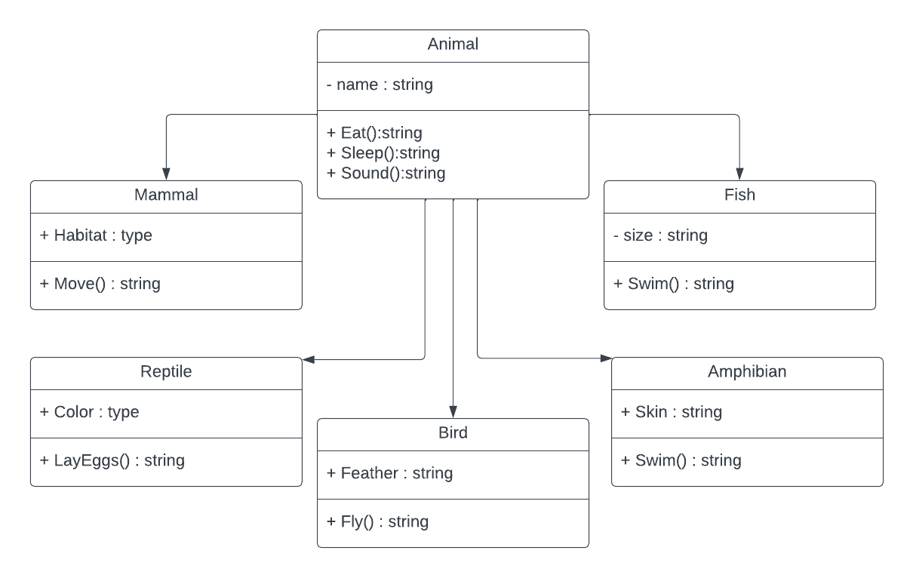

# Lab06-ZooApp

this is a simple Zoo application made using C#.
the purpose of this app is to practice OOP principles (Abstraction, Encapsulation, Inheritance, Polymorphism)
this app has 5 types of animals:

- Mammals
- Birds
- Fish
- Reptile
- Amphibian

## UML diagram

